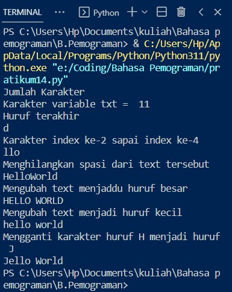
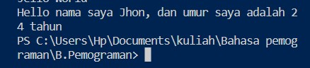

# Pratikum10
## Latihan 1
- Source code:
```
txt = "Hello World"
print("Jumlah Karakter")
print("Karakter variable txt = ",len (txt))
print("Huruf terakhir")
print(txt[10])
print("Karakter index ke-2 sapai index ke-4")
print(txt[2:5])
print("Menghilangkan spasi dari text tersebut")
print(txt.replace(" ",""))
print("Mengubah text menjaddu huruf besar")
print(txt.upper())
print("Mengubah text menjadi huruf kecil")
print(txt.lower())
print("Mengganti karakter huruf H menjadi huruf J")
print(txt.replace("H","J"))
```
- Hasil Ouput:


## Latihan 2
- Source code:
```
umur = 24
txt = 'Hello nama saya Jhon, dan umur saya adalah 24 tahun'
print(txt.format(umur)
```
- Hasil Ouput:
